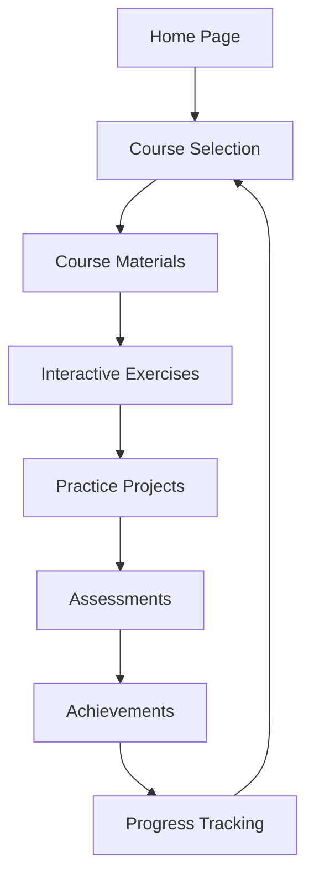

## 1. Product Overview
基于Python的数据分析在线教育平台，专为商务数据分析与应用专业学生设计，提供完整的课程体系和互动学习体验。
- 解决商务数据分析专业学生的学习需求，提供系统化的Python数据分析课程和实践机会
- 目标市场价值在于培养具备实际数据分析能力的商务人才，提升学生就业竞争力

## 2. Core Features

### 2.1 User Roles
| Role | Registration Method | Core Permissions |
|------|---------------------|------------------|
| Student | Email registration | Browse courses, access learning materials, complete exercises, take assessments, view achievements |
| Admin | Invitation only | Manage courses, users, content, and system settings |

### 2.2 Feature Module
1. **Home page**: Hero section, course categories, featured courses, user dashboard
2. **Course page**: Course details, curriculum, learning materials, interactive exercises
3. **Practice page**: Coding exercises, data analysis projects, submission and feedback
4. **Assessment page**: Quizzes, exams, results analysis
5. **Achievement page**: Badges, certificates, progress tracking

### 2.3 Page Details
| Page Name | Module Name | Feature description |
|-----------|-------------|---------------------|
| Home page | Hero section | Showcase platform value proposition, highlight key features, and encourage registration |
| Home page | Course categories | Organize courses by difficulty level and topic areas (e.g., data visualization, statistical analysis) |
| Home page | User dashboard | Display learning progress, recommended courses, and upcoming deadlines |
| Course page | Course details | Provide course description, prerequisites, learning objectives, and instructor information |
| Course page | Curriculum | Show detailed course outline with modules, lessons, and estimated completion time |
| Course page | Learning materials | Deliver video lectures, reading materials, and code examples |
| Course page | Interactive exercises | Embed coding environments for hands-on practice during lessons |
| Practice page | Coding exercises | Provide Python coding challenges with test cases and immediate feedback |
| Practice page | Data analysis projects | Offer real-world business data analysis scenarios for comprehensive practice |
| Practice page | Submission and feedback | Allow students to submit solutions and receive automated or instructor feedback |
| Assessment page | Quizzes | Create topic-specific quizzes with multiple choice, coding, and data interpretation questions |
| Assessment page | Exams | Administer timed comprehensive exams for course certification |
| Assessment page | Results analysis | Provide detailed performance reports and areas for improvement |
| Achievement page | Badges | Award badges for completed milestones, skills mastery, and participation |
| Achievement page | Certificates | Generate digital certificates for course completion and proficiency |
| Achievement page | Progress tracking | Visualize learning journey and skill development over time |

## 3. Core Process
### User Learning Flow
1. User registers and logs in to the platform
2. User browses course categories and selects a course
3. User accesses course materials and completes interactive lessons
4. User practices coding skills through exercises and projects
5. User takes assessments to test knowledge
6. User earns achievements and tracks progress

## 4. User Interface Design
### 4.1 Design Style
- Primary color: #3b82f6 (blue)
- Secondary color: #10b981 (green)
- Accent color: #f59e0b (amber)
- Button style: Rounded corners, subtle shadow, hover effects
- Font: Inter (sans-serif) for clean readability
- Font sizes: Headings (24-32px), body text (16px), captions (14px)
- Layout style: Card-based design with ample white space, responsive grid system
- Icon style: Modern, minimal line icons with consistent stroke weight

### 4.2 Page Design Overview
| Page Name | Module Name | UI Elements |
|-----------|-------------|-------------|
| Home page | Hero section | Full-width background with gradient, bold headline, call-to-action buttons, animated statistics |
| Home page | Course categories | Grid of category cards with icons, hover effects, and course counts |
| Home page | User dashboard | Clean card layout with progress bars, recent activity feed, and personalized recommendations |
| Course page | Course details | Hero image, course title, instructor info, enrollment button, review ratings |
| Course page | Curriculum | Collapsible modules, lesson timeline, progress indicators, completion checkmarks |
| Course page | Learning materials | Video player, code snippets with syntax highlighting, downloadable resources |
| Course page | Interactive exercises | Embedded code editor with run button, test case feedback, hints system |
| Practice page | Coding exercises | Challenge cards with difficulty indicators, submission form, leaderboard |
| Practice page | Data analysis projects | Project briefs, data set upload, analysis workspace, result submission |
| Assessment page | Quizzes | Timer, question navigation, answer selection interface, progress bar |
| Assessment page | Results analysis | Score visualization, incorrect answer review, skill gap analysis |
| Achievement page | Badges | Grid of earned and locked badges, badge details on hover, collection progress |
| Achievement page | Certificates | Certificate preview, download options, sharing functionality |

### 4.3 Responsiveness
- Desktop-first design with mobile-adaptive breakpoints
- Touch optimization for mobile devices
- Collapsible navigation menu on smaller screens
- Responsive grid layout that adjusts to screen size
- Optimized content display for different device orientations

### 4.4 3D Scene Guidance (Not applicable)
- No 3D elements required for this educational platform