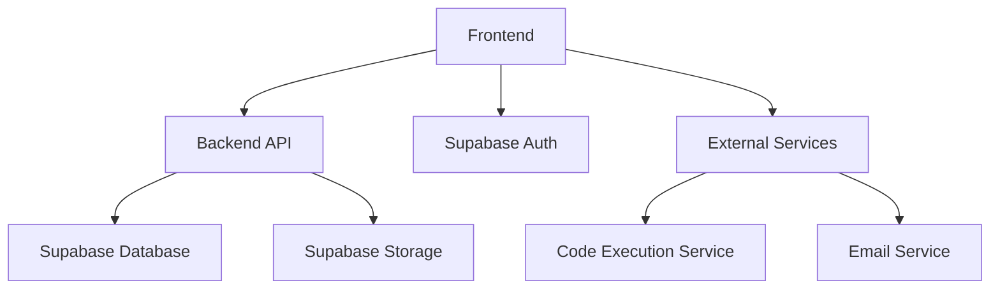
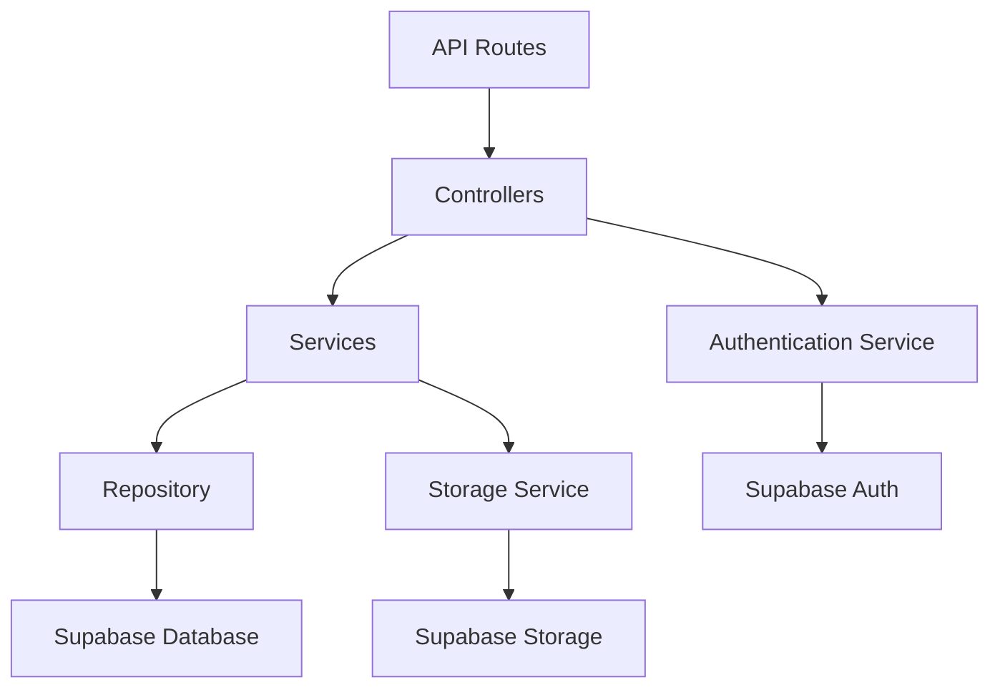
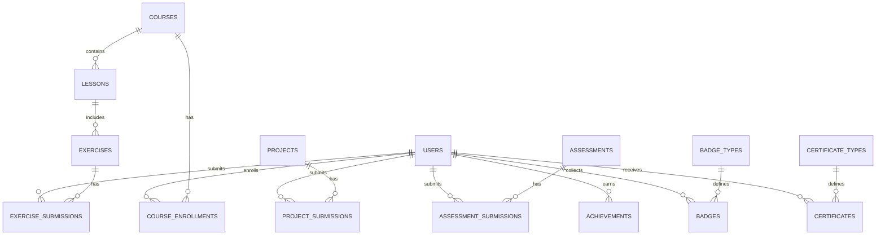

## 1. Architecture Design


## 2. Technology Description
- Frontend: React@18 + TypeScript + Tailwind CSS + Vite
- Initialization Tool: vite-init
- Backend: Supabase (Auth, Database, Storage)
- Database: Supabase (PostgreSQL)
- External Services:
  - Code execution service for Python code evaluation
  - Email service for notifications and password resets

## 3. Route Definitions
| Route | Purpose |
|-------|---------|
| / | Home page with dashboard and course categories |
| /courses | Course listing page |
| /courses/:id | Course details page |
| /courses/:id/lessons/:lessonId | Lesson content page |
| /practice | Practice exercises page |
| /practice/projects | Data analysis projects page |
| /assessments | Assessments listing page |
| /assessments/:id | Assessment details page |
| /achievements | User achievements and badges page |
| /profile | User profile and settings page |
| /auth/login | Login page |
| /auth/register | Registration page |
| /admin | Admin dashboard (restricted access) |

## 4. API Definitions
### Authentication APIs
- POST /auth/signup - User registration
- POST /auth/login - User login
- POST /auth/logout - User logout
- POST /auth/reset-password - Password reset request

### Course APIs
- GET /api/courses - Get all courses
- GET /api/courses/:id - Get course details
- GET /api/courses/:id/lessons - Get course lessons
- GET /api/lessons/:id - Get lesson details

### Practice APIs
- GET /api/exercises - Get practice exercises
- POST /api/exercises/:id/submit - Submit exercise solution
- GET /api/projects - Get data analysis projects
- POST /api/projects/:id/submit - Submit project solution

### Assessment APIs
- GET /api/assessments - Get available assessments
- POST /api/assessments/:id/submit - Submit assessment
- GET /api/assessments/:id/results - Get assessment results

### Achievement APIs
- GET /api/achievements - Get user achievements
- GET /api/badges - Get available badges
- GET /api/certificates - Get user certificates

## 5. Server Architecture Diagram


## 6. Data Model
### 6.1 Data Model Definition


### 6.2 Data Definition Language
```sql
-- Users table
CREATE TABLE users (
  id UUID PRIMARY KEY REFERENCES auth.users(id),
  email TEXT UNIQUE NOT NULL,
  name TEXT,
  role TEXT DEFAULT 'student',
  created_at TIMESTAMP WITH TIME ZONE DEFAULT NOW(),
  updated_at TIMESTAMP WITH TIME ZONE DEFAULT NOW()
);

-- Courses table
CREATE TABLE courses (
  id UUID PRIMARY KEY DEFAULT gen_random_uuid(),
  title TEXT NOT NULL,
  description TEXT,
  category TEXT,
  difficulty TEXT,
  duration TEXT,
  image_url TEXT,
  created_at TIMESTAMP WITH TIME ZONE DEFAULT NOW(),
  updated_at TIMESTAMP WITH TIME ZONE DEFAULT NOW()
);

-- Lessons table
CREATE TABLE lessons (
  id UUID PRIMARY KEY DEFAULT gen_random_uuid(),
  course_id UUID REFERENCES courses(id),
  title TEXT NOT NULL,
  content TEXT,
  video_url TEXT,
  order_index INTEGER,
  created_at TIMESTAMP WITH TIME ZONE DEFAULT NOW(),
  updated_at TIMESTAMP WITH TIME ZONE DEFAULT NOW()
);

-- Course enrollments table
CREATE TABLE course_enrollments (
  id UUID PRIMARY KEY DEFAULT gen_random_uuid(),
  user_id UUID REFERENCES users(id),
  course_id UUID REFERENCES courses(id),
  progress INTEGER DEFAULT 0,
  enrolled_at TIMESTAMP WITH TIME ZONE DEFAULT NOW(),
  completed_at TIMESTAMP WITH TIME ZONE
);

-- Exercises table
CREATE TABLE exercises (
  id UUID PRIMARY KEY DEFAULT gen_random_uuid(),
  lesson_id UUID REFERENCES lessons(id),
  title TEXT NOT NULL,
  description TEXT,
  difficulty TEXT,
  test_cases JSONB,
  created_at TIMESTAMP WITH TIME ZONE DEFAULT NOW(),
  updated_at TIMESTAMP WITH TIME ZONE DEFAULT NOW()
);

-- Exercise submissions table
CREATE TABLE exercise_submissions (
  id UUID PRIMARY KEY DEFAULT gen_random_uuid(),
  user_id UUID REFERENCES users(id),
  exercise_id UUID REFERENCES exercises(id),
  code TEXT,
  result JSONB,
  score INTEGER,
  submitted_at TIMESTAMP WITH TIME ZONE DEFAULT NOW()
);

-- Projects table
CREATE TABLE projects (
  id UUID PRIMARY KEY DEFAULT gen_random_uuid(),
  title TEXT NOT NULL,
  description TEXT,
  difficulty TEXT,
  data_set_url TEXT,
  requirements JSONB,
  created_at TIMESTAMP WITH TIME ZONE DEFAULT NOW(),
  updated_at TIMESTAMP WITH TIME ZONE DEFAULT NOW()
);

-- Project submissions table
CREATE TABLE project_submissions (
  id UUID PRIMARY KEY DEFAULT gen_random_uuid(),
  user_id UUID REFERENCES users(id),
  project_id UUID REFERENCES projects(id),
  solution TEXT,
  analysis JSONB,
  score INTEGER,
  feedback TEXT,
  submitted_at TIMESTAMP WITH TIME ZONE DEFAULT NOW()
);

-- Assessments table
CREATE TABLE assessments (
  id UUID PRIMARY KEY DEFAULT gen_random_uuid(),
  title TEXT NOT NULL,
  description TEXT,
  course_id UUID REFERENCES courses(id),
  duration INTEGER,
  questions JSONB,
  created_at TIMESTAMP WITH TIME ZONE DEFAULT NOW(),
  updated_at TIMESTAMP WITH TIME ZONE DEFAULT NOW()
);

-- Assessment submissions table
CREATE TABLE assessment_submissions (
  id UUID PRIMARY KEY DEFAULT gen_random_uuid(),
  user_id UUID REFERENCES users(id),
  assessment_id UUID REFERENCES assessments(id),
  answers JSONB,
  score INTEGER,
  submitted_at TIMESTAMP WITH TIME ZONE DEFAULT NOW()
);

-- Badge types table
CREATE TABLE badge_types (
  id UUID PRIMARY KEY DEFAULT gen_random_uuid(),
  name TEXT NOT NULL,
  description TEXT,
  icon_url TEXT,
  condition JSONB,
  created_at TIMESTAMP WITH TIME ZONE DEFAULT NOW()
);

-- Badges table
CREATE TABLE badges (
  id UUID PRIMARY KEY DEFAULT gen_random_uuid(),
  user_id UUID REFERENCES users(id),
  badge_type_id UUID REFERENCES badge_types(id),
  earned_at TIMESTAMP WITH TIME ZONE DEFAULT NOW()
);

-- Certificate types table
CREATE TABLE certificate_types (
  id UUID PRIMARY KEY DEFAULT gen_random_uuid(),
  name TEXT NOT NULL,
  description TEXT,
  course_id UUID REFERENCES courses(id),
  created_at TIMESTAMP WITH TIME ZONE DEFAULT NOW()
);

-- Certificates table
CREATE TABLE certificates (
  id UUID PRIMARY KEY DEFAULT gen_random_uuid(),
  user_id UUID REFERENCES users(id),
  certificate_type_id UUID REFERENCES certificate_types(id),
  issued_at TIMESTAMP WITH TIME ZONE DEFAULT NOW(),
  expires_at TIMESTAMP WITH TIME ZONE
);

-- Grant permissions
GRANT SELECT ON users, courses, lessons, course_enrollments, exercises, projects, assessments, badge_types, certificate_types TO anon;
GRANT ALL PRIVILEGES ON users, course_enrollments, exercise_submissions, project_submissions, assessment_submissions, badges, certificates TO authenticated;
```